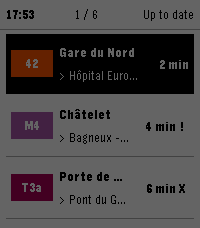
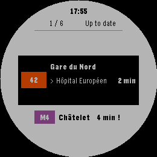
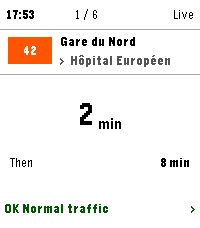
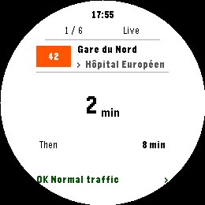

<p align="center">
  
</p>

<h1 align="center">Lapin Futé</h1>

<p align="center">
  <strong>Next arrivals and line traffic at a glance, on your Pebble.</strong>
  <br>
  Keep six favorite journeys across Île-de-France and check them without reaching for your phone.
</p>

<p align="center">
  <a href="https://apps.repebble.com/6d6aa01b7ecb4cfea469a183">Get Lapin Futé</a>
  · <a href="#features">Features</a>
  · <a href="#compatibility">Compatibility</a>
  · <a href="#getting-started">Getting started</a>
  · <a href="#watch-controls">Watch controls</a>
  · <a href="#privacy">Privacy</a>
  · <a href="#build-from-source">Build from source</a>
  · <a href="LICENSE">MIT License</a>
</p>

<p align="center">
  
  
</p>

## About

Lapin Futé puts Île-de-France public-transport arrivals on a Pebble watch. The watch shows a list of favorite journeys with their next arrivals, an arrival board for each, and the current service messages for its line. A companion on your phone fetches the data from PRIM, Île-de-France Mobilités' open-data platform, and prepares everything the watch displays; the watch itself never goes online.

<p align="center">
  
  
</p>
<p align="center">
  
  
</p>

## Features

- **Six favorite journeys, five transport modes.** A favorite is a departure stop, a line, and a reachable arrival stop, including intermediate stops that no service terminates at. Journeys stay on one line, without connections, across Métro, RER, Transilien, Tram, and Bus. Favorites are renamed and reordered on the phone page, which shows official line badges and colors.
- **Arrivals at a glance.** The favorites list shows the next arrival for each journey; Select opens its arrival board. Confirmed full-line and short-turn services are combined chronologically. Departures known not to serve the journey are excluded; uncertain departures follow the confirmed ones, marked with `?` and retaining their real times. Conflicting terminal hints can still confirm a journey when every candidate route serves its arrival. Countdowns keep ticking on the watch between refreshes.
- **Traffic view.** Select again on an arrival board to read the most recently updated active disruption for that line, using PRIM's `lastUpdate` rather than severity. Active works participate in the same selection and can report stopped or delayed service; future, expired, and information-only notices remain excluded. Periods are reevaluated on existing request triggers, not by a new timer. If the selected English message lacks a usable title or body, the app uses the complete French message for that same incident. This may require one additional French request when no fresh French response is already available.
- **Refresh when needed.** Open the app, switch favorite, choose Refresh all, or hold Select to request arrivals. Recent results are reused for 60 seconds; after a failed refresh, the last complete result remains visibly stale for at most 15 minutes. There is no periodic network polling.
- **Clear data states.** The app distinguishes real-time arrivals, mixed real-time and scheduled results, updates in progress, missing cached data, and trips whose route to your arrival is unconfirmed (`?`).
- **English and French.** In settings, choose Automatic to follow the watch system language, or force Français or English for the watch app. Save applies the choice even when favorites are unchanged. The phone remembers it across restarts; reopening settings uses the effective language.
- **Settings that fit your phone.** Light and dark themes follow your system preference. Collapsible sections keep favorite editing, PRIM access, and watch synchronization easy to reach.

## Compatibility

| Requirement | Details |
|---|---|
| Watches | Pebble Time 2 (emery profile, primary target); the Pebble Round 2 profile is experimental |
| Firmware | 4.32 or newer |
| Phone | Pebble mobile app running the companion; internet access needed for fresh data |
| Building from source | Node.js 24.18.0, Bun, Pebble SDK 4.33.1, pebble-tool 5.0.40 |

## Getting started

1. Install [Lapin Futé from RePebble](https://apps.repebble.com/6d6aa01b7ecb4cfea469a183).
2. In the Pebble mobile app, open Lapin Futé's settings. Under PRIM access, paste a personal access token generated on the [PRIM portal](https://prim.iledefrance-mobilites.fr/fr/mes-jetons-authentification).
3. Add up to six favorite journeys: search the departure stop, pick the line and boarding point, then pick a reachable arrival stop, including intermediate stops. Searching and adding work without a token. Save, and your settings sync to the watch. Favorites saved with an earlier version keep their name, order, and labels; their arrival is filled in automatically from the updated catalog, and until that succeeds they show as unresolved. A settings page opened by an older companion stays read-only until the watch app is updated.
4. Open Lapin Futé on the watch. Arrivals refresh whenever the app opens, you change favorite, or you hold Select; the phone needs to be connected for fresh data.

Developers can also build and install the app locally using the instructions in [Build from source](#build-from-source).

## Watch controls

| Screen | Control | Action |
|---|---|---|
| Favorites | **Up / Down** | Move through favorites and the **Refresh all** row |
| Favorites | **Select** | Open the highlighted favorite |
| Favorites · Refresh all | **Select** | Refresh every favorite |
| Arrivals | **Up / Down** | Switch favorite |
| Arrivals | **Select** | Open the traffic view |
| Arrivals | **Hold Select** | Force a refresh |
| Traffic | **Up / Down** | Page through messages |
| Any screen | **Back** | Return to the previous screen |

Countdowns and the clock keep updating on the watch every minute; only the actions above trigger network requests.

## Privacy

Your PRIM token stays on your phone. It is stored locally and sent only as the request header of the companion's direct HTTPS calls to PRIM, which is operated by Île-de-France Mobilités. It never reaches the watch, your favorites, cached data, URLs, or logs. Browsing the settings page and its station catalog sends no credentials. The app has no telemetry, no analytics, and no background or periodic network activity.

## Build from source

Install the pinned prerequisites from the table above; no repository script installs a toolchain for you.

```sh
npm test
npm run build
```

`npm run build` runs the test suite, generates the bilingual display copy, bundles the watchapp for emery and gabbro, and verifies the result. The watch build needs no catalog and no network. Its one optional input is the settings-page URL:

```sh
LAPIN_FUTE_CONFIG_URL=https://example.org/lapin-fute/ npm run build
```

The station catalog is generated ahead of time from open IDFM datasets. Format 4 embeds each line's journey patterns — stop sequences with boarding and alighting restrictions, plus the terminal aliases the phone matches against announced destinations — and there is no in-place upgrade: an existing catalog must be rebuilt and republished in full. Until that catalog is live, the settings page cannot list arrival stops or resolve migrated favorites, and on the watch a favorite whose arrival never resolved shows no departures while one whose line patterns are missing shows its departures as uncertain. With `IDFM_DATASET_TOKEN` in `.env`:

```sh
node --env-file=.env scripts/refresh-catalog.mjs   # download, build, and publish the catalog
npm run build:config-site                          # assemble var/config-site; fails without a published catalog
```

`node --env-file=.env scripts/probe-catalog.mjs` runs a small live check against PRIM, one request per transport mode, and needs a `PRIM_API_KEY`. Operator tokens live only in `.env` and are never printed or embedded in build output.

To rebuild the hosted catalog independently, run **Rebuild and publish IDFM catalog** from GitHub Actions, using `.github/workflows/rebuild-catalog.yml`. It uses the existing `production` environment's IDFM and Bunny credentials and publishes only catalog files, with up to 75 concurrent curl uploads. The manifest is uploaded last. It does not build the PBW, deploy the settings page, or create a GitHub release.

Uploads are skipped when the hosted IDFM source revision is unchanged. Enable `force_catalog_upload` when republishing a catalog format change from the same source data. The workflow retains the previous manifest for rollback and shares the production publication lock with page deployments and rollbacks. Release tags continue through `deploy-bunny.yml`, without rebuilding the catalog.

## Contributing

Bug reports are welcome on the [issue tracker](https://github.com/Anthodev/lapin-fute/issues). A useful report includes the watch model and firmware, the phone setup, the steps to reproduce, and whether the data shown was live or cached. Never paste your PRIM token or other personal data in an issue.

Code changes should keep the frozen message contracts and the phone-only credential boundary intact.
